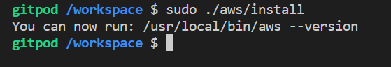

# Week 0 — Billing and Architecture

# Required Homework

## Recreating Cruddur Logical Architecture

I recreated the Cruddur Logical diagram. 

Here is a screenshot.


Still could make it better but its a work in progress.

Here is further proof

[Cruddur Logical Diagram](https://lucid.app/lucidchart/72ad9a9b-621a-4c78-9fa9-84d37990deed/edit?viewport_loc=-837%2C623%2C2684%2C1146%2C0_0&invitationId=inv_f57dc6c3-a22c-4620-afd5-7e9e7d60f05a)

## Creating Conceptual Napkin diagram

I drew a conceptual diagram on a napkin.


Heres a little note on the **components** of the diagram:

- **User Data:** This component represents the information about the users of the Cruddur app, such as their profile data, tweets, followers and other relevant information.

- **Frontend:** This component represents the user interface of the Cruddur app, which users interact with on their mobile devices or web browsers. The frontend handles user input, communicates with the backend, and displays data to the user.

- **Backend API:** This component provides a RESTful API for the frontend to interact with the backend. The API handles incoming requests, communicates with the data service, and sends responses back to the frontend.

- **Mobile App:** This component represents the obile version of the twitter app, which is optimized for use on smartphones and tablets.

- **Web App:** This component represents the web version of the Twitter app, which is optimized for us on desktop and laptop computers.

- **Data Servic:** This component manages the data for the twitter app, which included user data, tweets and oter relevant information, The data service communicates with the database to store and retrieve data.

- **Database:** This component represents the database where the user data, tweets, and other relevant information are stored.

### Install AWS CLI

- I installed the AWS CLI using gitpod.
- I set AWS CLI to use partial autoprompt mode to make it easier to debug CLI commands.
- The bash commands I used can also be found at [AWS CLI Install Instructions]https://docs.aws.amazon.com/cli/latest/userguide/getting-started-install.html

Update our `.gitpod.yml` to include the following task.

```sh
tasks:
  - name: aws-cli
    env:
      AWS_CLI_AUTO_PROMPT: on-partial
    init: |
      cd /workspace
      curl "https://awscli.amazonaws.com/awscli-exe-linux-x86_64.zip" -o "awscliv2.zip"
      unzip awscliv2.zip
      sudo ./aws/install
      cd $THEIA_WORKSPACE_ROOT
```


## Creating a Billing Alarm

### Create SNS Topic

- We need an SNS topic before we create an alarm.
- The SNS topic is what will delivery us an alert when we get overbilled
- [aws sns create-topic](https://docs.aws.amazon.com/cli/latest/reference/sns/create-topic.html)

I created an SNS Topic
```sh
aws sns create-topic --name billing-alarm
```
which  returned a TopicARN

I created a subscription to apply the TopicARN and my Email
```sh
aws sns subscribe \
    --topic-arn TopicARN \
    --protocol email \
    --notification-endpoint danielamadi000@email.com
```

#### Create Alarm

- [aws cloudwatch put-metric-alarm](https://docs.aws.amazon.com/cli/latest/reference/cloudwatch/put-metric-alarm.html)
- [Create an Alarm via AWS CLI](https://aws.amazon.com/premiumsupport/knowledge-center/cloudwatch-estimatedcharges-alarm/)
- We need to update the configuration json script with the TopicARN we generated earlier
- We are just a json file because --metrics is is required for expressions and so its easier to us a JSON file.

```sh
aws cloudwatch put-metric-alarm --cli-input-json file://aws/json/alarm_config.json
```

## Create an AWS Budget

[aws budgets create-budget](https://docs.aws.amazon.com/cli/latest/reference/budgets/create-budget.html)

```sh
aws budgets create-budget \
    --account-id AccountID \
    --budget file://aws/json/budget.json \
    --notifications-with-subscribers file://aws/json/budget-notifications-with-subscribers.json
```
