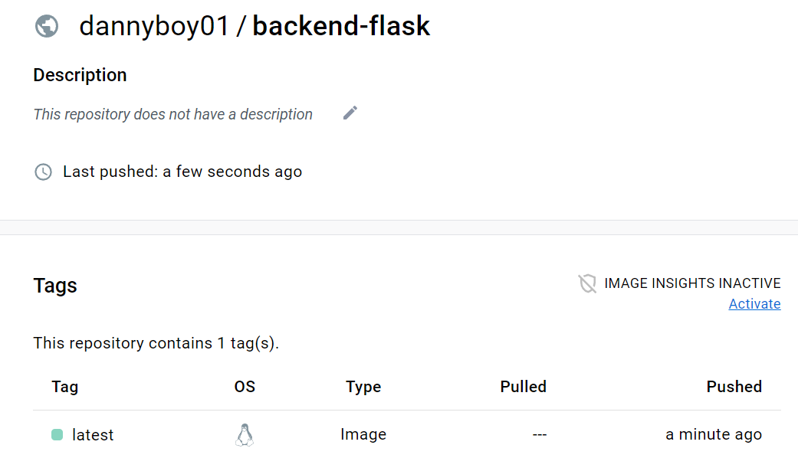
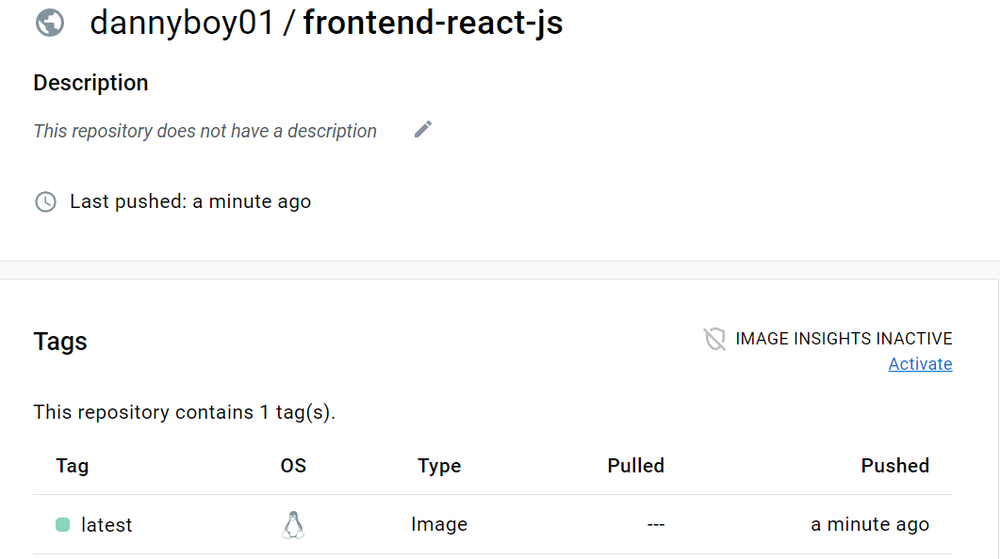

# Week 1 — App Containerization

## Why Containerize?
1. We containerize our apps to make it portable and also ensure lack of documentation of application and OS configuration.
2. To ensure you don't destroy your environment when doing testing.
3. To avoid having different variants of OS and enable you replicate the container environments in different workspaces and
   not have to worry about each user's different requirements.

## Containerize Backend
Create a Docker file here:  `backend-flask/Dockerfile`

```dockerfile
FROM python:3.10-slim-buster

WORKDIR /backend-flask

COPY requirements.txt requirements.txt
RUN pip3 install -r requirements.txt

COPY . .

ENV FLASK_ENV=development

EXPOSE ${PORT}
CMD [ "python3", "-m" , "flask", "run", "--host=0.0.0.0", "--port=4567"]
```
### Run Flask(**Locally**)

```sh
cd backend-flask
export FRONTEND_URL="*"
export BACKEND_URL="*"
python3 -m flask run --host=0.0.0.0 --port=4567
cd ..
```

> This script configures environment variables to get our endpoint working.

 [Endpoint](https://4567-nielsen2e-awsbootcampcr-afx5p2tp8vw.ws-eu89.gitpod.io/api/activities/home)
 
- make sure to unlock the port on the port tab
- open the link for 4567 in your browser

> unset env vars
- `unset BACKEND_URL`
- `unset FRONTEND_URL`

### Build container
```
docker build -t  backend-flask ./backend-flask
```
### Run container
```
docker run --rm -p 4567:4567 -it backend-flask
```
### Run container and set env vars
```
docker run --rm -p 4567:4567 -it -e FRONTEND_URL='*' -e BACKEND_URL='*' backend-flask
```
## Containerize Frontend
Create a Dockerfile here: `frontend-react-js/Dockerfile`

```dockerfile
FROM node:16.18

ENV PORT=3000

COPY . /frontend-react-js
WORKDIR /frontend-react-js
RUN npm install
EXPOSE ${PORT}
CMD ["npm", "start"]
```
### Build container
```
docker build -t frontend-react-js ./frontend-react-js
```
### Run Container
```
docker run -p 3000:3000 -d frontend-react-js
```
## Creating Multiple Containers
### Create a **docker-compose** file at the root of the project
- Docker-compose file allows us to run multiple containes at the same time.
  - Using docker-compose allows us orchestrate multiple containers that have to work together locally.
```yml
version: "3.8"
services:
  backend-flask:
    environment:
      FRONTEND_URL: "https://3000-${GITPOD_WORKSPACE_ID}.${GITPOD_WORKSPACE_CLUSTER_HOST}"
      BACKEND_URL: "https://4567-${GITPOD_WORKSPACE_ID}.${GITPOD_WORKSPACE_CLUSTER_HOST}"
    build: ./backend-flask
    ports:
      - "4567:4567"
    volumes:
      - ./backend-flask:/backend-flask
  frontend-react-js:
    environment:
      REACT_APP_BACKEND_URL: "https://4567-${GITPOD_WORKSPACE_ID}.${GITPOD_WORKSPACE_CLUSTER_HOST}"
    build: ./frontend-react-js
    ports:
      - "3000:3000"
    volumes:
      - ./frontend-react-js:/frontend-react-js

# the name flag is a hack to change the default prepend folder
# name when outputting the image names
networks: 
  internal-network:
    driver: bridge
    name: cruddur
```
## Adding Dynamo DB local and Postgres
We are going to add Dynamo db and Postgres services to our docker compose file.
### Dynamo DB
```yml
  dynamodb-local:
    # https://stackoverflow.com/questions/67533058/persist-local-dynamodb-data-in-volumes-lack-permission-unable-to-open-databa
    # We needed to add user:root to get this working.
    user: root
    command: "-jar DynamoDBLocal.jar -sharedDb -dbPath ./data"
    image: "amazon/dynamodb-local:latest"
    container_name: dynamodb-local
    ports:
      - "8000:8000"
    volumes:
      - "./docker/dynamodb:/home/dynamodblocal/data"
    working_dir: /home/dynamodblocal
```
### Postgres
```yml
  db:
    image: postgres:13-alpine
    restart: always
    environment:
      - POSTGRES_USER=postgres
      - POSTGRES_PASSWORD=password
    ports:
      - '5432:5432'
    volumes: 
      - db:/var/lib/postgresql/data
```
### To install postgres client into gitpod
```sh
  - name: postgres
    init: |
      curl -fsSL https://www.postgresql.org/media/keys/ACCC4CF8.asc|sudo gpg --dearmor -o /etc/apt/trusted.gpg.d/postgresql.gpg
      echo "deb http://apt.postgresql.org/pub/repos/apt/ `lsb_release -cs`-pgdg main" |sudo tee  /etc/apt/sources.list.d/pgdg.list
      sudo apt update
      sudo apt install -y postgresql-client-13 libpq-dev
```
**Test Postgres**
```
psql -Upostgres --host localhost
```

## Volumes
- This should be added after networks
  - Directory volume mapping
```yml
volumes: 
- "./docker/dynamodb:/home/dynamodblocal/data"
```
   - Named volume mapping
```yml
volumes: 
  - db:/var/lib/postgresql/data

volumes:
  db:
    driver: local
```
## Create Dynamo DB database
**Example of using Dynamo db local** : https://github.com/100DaysOfCloud/challenge-dynamodb-local

### Create a Local Table
```db
aws dynamodb create-table \
    --endpoint-url http://localhost:8000 \
    --table-name Music \
    --attribute-definitions \
        AttributeName=Artist,AttributeType=S \
        AttributeName=SongTitle,AttributeType=S \
    --key-schema AttributeName=Artist,KeyType=HASH AttributeName=SongTitle,KeyType=RANGE \
    --provisioned-throughput ReadCapacityUnits=1,WriteCapacityUnits=1 \
    --table-class STANDARD
```
### Create an item
```db
aws dynamodb put-item \
    --endpoint-url http://localhost:8000 \
    --table-name Music \
    --item \
        '{"Artist": {"S": "No One You Know"}, "SongTitle": {"S": "Call Me Today"}, "AlbumTitle": {"S": "Somewhat Famous"}}' \
    --return-consumed-capacity TOTAL  
```
### List Tables
```db
aws dynamodb list-tables --endpoint-url http://localhost:8000
```

### Get Records
```db
aws dynamodb scan --table-name Music --query "Items" --endpoint-url http://localhost:8000
```
## Create an endpoint for  the notification feature(Frontend and Backend)
### Backend
- Go to openapi.yml and create a new api called `/api/activities/notifications`
```yml
 /api/activities/notifications:
    get:
      description: 'Return a feed of activity for all those I follow'
      tags:
        - activities
      parameters: []
      responses:
        '200':
          description: Returns an array of activities
          content:
            application/json:
              schema:
                type: array
                items:
                  $ref: '#/components/schemas/Activity'
```
- Go to backend-flask and define a new endpoint using the entrypoint `app.py`
  - Create a new route using `GET` and `/api/activities/notifications`
```python
@app.route("/api/activities/notifications", methods=['GET'])
def data_notifications():
  data = NotificationsActivities.run()
  return data, 200
```
- Create a new file called `notifications_activities.py` under `services` in backend-flask.
- Create an extra line in `app.py`
```python
from services.notificaions_activities import*
```
- Go to the `home_activities.py` and copy the below code
```python
from datetime import datetime, timedelta, timezone
class NotificationsActivities:
  def run():
    now = datetime.now(timezone.utc).astimezone()
    results = [{
      'uuid': '68f126b0-1ceb-4a33-88be-d90fa7109eee',
      'handle':  'daniel',
      'message': 'Mafejo kpami Altschool!',
      'created_at': (now - timedelta(days=2)).isoformat(),
      'expires_at': (now + timedelta(days=5)).isoformat(),
      'likes_count': 5,
      'replies_count': 1,
      'reposts_count': 0,
      'replies': [{
        'uuid': '26e12864-1c26-5c3a-9658-97a10f8fea67',
        'reply_to_activity_uuid': '68f126b0-1ceb-4a33-88be-d90fa7109eee',
        'handle':  'Worf',
        'message': 'This post has no honor!',
        'likes_count': 0,
        'replies_count': 0,
        'reposts_count': 0,
        'created_at': (now - timedelta(days=2)).isoformat()
      }],
    }
    ]
    return results
```
**Change `HomeActivities` to `NotificationsActivities`**
- Save and check endpoint https://4567-nielsen2e-awsbootcampcr-0liohj6qoii.ws-eu89.gitpod.io/api/activities/notifications

### Frontend
- Go to `App.js` in `frontend-react-js` and add the code below:
```python
import './App.css';

import HomeFeedPage from './pages/HomeFeedPage';
import NotificationsFeedPage from './pages/NotificationsFeedPage';
import UserFeedPage from './pages/UserFeedPage';
import SignupPage from './pages/SignupPage';
import SigninPage from './pages/SigninPage';
import RecoverPage from './pages/RecoverPage';
import MessageGroupsPage from './pages/MessageGroupsPage';
import MessageGroupPage from './pages/MessageGroupPage';
import ConfirmationPage from './pages/ConfirmationPage';
import React from 'react';
import {
  createBrowserRouter,
  RouterProvider
} from "react-router-dom";

const router = createBrowserRouter([
  {
    path: "/",
    element: <HomeFeedPage />
  },
  {
    path: "/notifications",
    element: <NotificationsFeedPage />
  },
  {
    path: "/@:handle",
    element: <UserFeedPage />
  },
  {
    path: "/messages",
    element: <MessageGroupsPage />
  },
  {
    path: "/messages/@:handle",
    element: <MessageGroupPage />
  },
  {
    path: "/signup",
    element: <SignupPage />
  },
  {
    path: "/signin",
    element: <SigninPage />
  },
  {
    path: "/confirm",
    element: <ConfirmationPage />
  },
  {
    path: "/forgot",
    element: <RecoverPage />
  }
]);

function App() {
  return (
    <>
      <RouterProvider router={router} />
    </>
  );
}

export default App;
```
- Create a new file called `NotificationsFeedPage.js` under `pages` in **frontend-react-js**
- Copy `HomeFeedPage.js` into `NotificationFeedPage.js` and change `line 23` to `/api/activities/notifications` and line 13 to `NotificationsFeedPage`.
- Change lines 60 and 75 to `notifications` and `Notifications`

## Homework Challenges
### Run the dockerfile CMD as an external script
```dockerfile
FROM python:3.10-slim-buster

# Inside Container
# Make new folder inside container
WORKDIR /backend-flask

# Outside container -> Inside container
# This contains libraries to install
COPY requirements.txt requirements.txt

# Inside container
# Install python libraries used for the app
RUN pip3 install -r requirements.txt

# Outside container -> Inside container
# . means everything in the current directory
# First period - (?backend-flask) (outside container)
# second period - (/backend-flask) (Inside container)
COPY . .

# Set environment variables
# Inside container and remain when container is running
ENV FLASK_ENV=development

EXPOSE ${PORT}

#This copies the script.sh script file from the build context to the root of the Docker image file system. 
COPY script.sh /script.sh

#This sets the executable permission on the script.sh file inside the Docker container. 
RUN chmod +x /script.sh

CMD ["/script.sh"]
```
### Script
```sh
#!/bin/sh
python3 -m flask run --host=0.0.0.0 --port=4567
```

### Push and tag image to dockerhub
- Create an account on **dockerhub**.
- Login to dockerhub on your local machine using `docker login` and fill your username and password.
- Build your docker image using `docker build -t username/imagename:tag file-location`
  - backend: 
   `docker build -t dannyboy01/backend-flask:latest ./backend-flask`
  - frontend:
   `docker build -t dannyboy01/frontend-react-js:latest ./frontend-react-js`
- Push to dockerhub:
   - backend: 
   `docker push dannyboy01/backend-flask:latest`
  - frontend:
   `docker push dannyboy01/frontend-react-js:latest`
 - You can also pull using `docker pull username/imagename:tag`




## Use multi-stage building for a Dockerfile build
### Backend
```dockerfile
# Stage 1: Build and install the dependencies
FROM python:3.10-slim-buster AS build

WORKDIR /backend-flask

COPY requirements.txt requirements.txt

RUN pip3 install --no-cache-dir -r requirements.txt

# Stage 2: Copy the application and run it
FROM python:3.10-slim-buster

WORKDIR /backend-flask

COPY --from=build /backend-flask .

ENV FLASK_ENV=development

EXPOSE ${PORT}

CMD ["python3", "-m", "flask", "run", "--host=0.0.0.0", "--port=4567"]
```
1. **build stage**: In this stage, we copy the requirements.txt file, install the Python dependencies, and store them in a separate image layer. This reduces the size of the final image by separating the application code from its dependencies.

2. **python:3.10-slim-buster stage**: In this stage, we copy the application code from the build stage, set the FLASK_ENV environment variable, expose the ${PORT} port, and start the Flask application.
### Frontend
```dockerfile
# Stage 1: Build and install dependencies
FROM node:16.18 AS build

WORKDIR /frontend-react-js

COPY package.json package-lock.json ./
RUN npm install --no-cache

COPY . ./

RUN npm run build

# Stage 2: Create a minimal image with the built application
FROM node:16.18-slim

ENV PORT=3000

WORKDIR /frontend-react-js

COPY --from=build /frontend-react-js/build ./build
COPY --from=build /frontend-react-js/node_modules ./node_modules

EXPOSE ${PORT}

CMD ["npm", "start"]
```
1. **build stage**: This stage installs dependencies, builds the React application, and creates a production-ready build.

2. **node:16.18-slim stage**: This stage copies the built React application from the build stage, installs only the required dependencies, and runs the application.

**By using multi-stage builds, we're able to reduce the size of the final Docker image by only including the built application and its required dependencies, without including any of the build tools or intermediate files that were needed in the build stage. This can help make the Docker image smaller and more secure, as it reduces the attack surface of the final image.**
